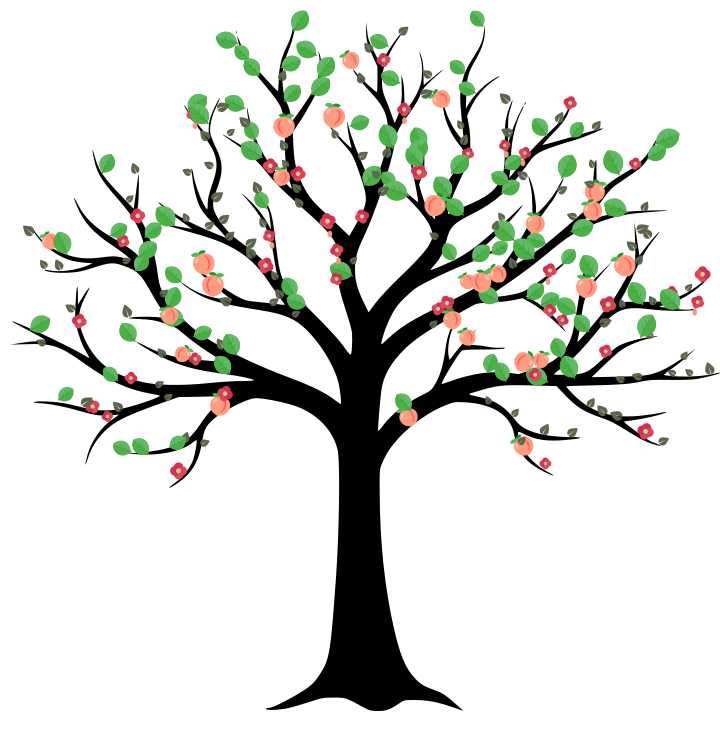

# 🌳 GitFruitTree

> **Превратите свою историю коммитов в живое дерево.**

Каждый ваш коммит становится частью дерева, которое растёт вместе с вашей активностью на GitHub.

В отличие от обычного Contribution Graph, здесь **каждый день навсегда получает своё место в кроне**. Листья не перемещаются, история не перерисовывается - дерево постепенно заполняется и становится уникальным отражением вашей активности.



---

## ✨ Как это работает

Каждая дата соответствует собственной точке в кроне.

Если в этот день не было коммитов - место остаётся пустым.

Стадия зависит не от абсолютного числа коммитов, а от `contributionLevel` - того же значения, по которому GitHub красит квадратик в самом календаре (относительно вашей собственной активности). Так же считает "зелёность" бот-змейка, поедающий контрибуции.

| contributionLevel | Стадия |
|---:|:-------|
| NONE | — |
| FIRST_QUARTILE | 🌱 Почка |
| SECOND_QUARTILE | 🍃 Лист |
| THIRD_QUARTILE | 🌸 Цветок |
| FOURTH_QUARTILE | 🍑 Персик |

> Маппинг полностью настраивается (`LEVEL_TO_STAGE` в `src/config.js`).

---

## 🍃 Сезоны

Цвет дерева зависит **не от даты коммита**, а от **текущего времени года**.

Это означает, что всё дерево меняет окраску одновременно.

- 🌸 Весна
- 🌿 Лето
- 🍂 Осень
- ❄️ Зима

Таким образом дерево выглядит живым!

---

## 🌿 Как выглядит крона

- **Наложения.** У каждого выросшего элемента известен реальный радиус (с учётом случайного размера), и перед отрисовкой проходит несколько проходов "расталкивания" - крупные персики и листья слегка раздвигаются, если пересекаются, мелкие почки почти не двигаются. Небольшое наложение остаётся специально - это всё ещё полная крона, а не набор ровно расставленных точек.
- **Точка крепления.** Вращение, масштаб и отражение каждого элемента считаются не от центра иконки, а от точки крепления (`STAGE_ATTACH` в `src/config.js`) - именно она садится на ветку.
- **Покачивание.** Только лист - вращается вокруг точки крепления. Цветы и персики специально не качаются. Это SMIL-анимация, не видна в статичном PNG или в большинстве превьюшек файлов - открывайте `output/preview.svg` прямо в браузере.
- **Падающие лепестки.** У части цветов (~30%, детерминированно по дате) с шансом отрывается лепесток и медленно падает вбок, сжимаясь, а не пропадает резко.
- **Кора.** Лёгкая текстура поверх ствола через SVG-фильтр, не привязана к данным. Если ваш SVG-просмотрщик не поддерживает фильтры/blend-mode - просто не увидите эффекта, ошибки в этом нет.
- **Фон и трава - ваши собственные файлы.** `assets/fone-leafs.svg` (если добавите) рисуется ЗА стволом. `assets/ground.svg` (если добавите) рисуется ПОВЕРХ ствола и кроны. Оба необязательны - нет файла, просто ничего не рисуется. Авторить в той же системе координат, что и `trunk.svg` (viewBox `0 0 720 736`), вставляется как есть. Если использовать в них те же плейсхолдеры `{{COLOR}}`/`{{PETAL}}`/`{{POLLEN}}`, что и в `assets/leaf.svg` - они тоже подхватят цвет сезона.

---

## 🌱 Главное отличие

В большинстве подобных проектов элементы постоянно "ездят" вместе с окном последних недель GitHub.

**Contribution Tree работает иначе.**

Каждый день получает постоянную позицию в кроне (`src/positions.js`), которая никогда не меняется.

История сохраняется в `src/index.json`, поэтому после каждого запуска дерево только растёт.

Новые дни появляются на кроне, старые остаются на своих местах навсегда.

---

## Проверить локально, без токена и без гита

Есть готовый скрипт `scripts/preview.mjs` - подделывает историю
коммитов (в формате `{count, level}`, как реально приходит из GitHub
API) и сразу пишет `output/preview.svg`, не трогая сеть и `src/index.json`:

```
node scripts/preview.mjs
```

После открой `output/preview.svg`.

Чтобы проверить сезонность (в том числе на своих SVG, без правки кода) -
передайте сезон или дату аргументом:

```
node scripts/preview.mjs winter
node scripts/preview.mjs 2026-12-25
```

Полезно после смены `assets/leaf.svg`/`flower.svg` или добавления
`ground.svg` с плейсхолдерами - сразу видно, как каждый сезон красит
именно ваши файлы, ничего в коде менять не нужно.

---

## Настройка у себя 
1. Форкните репозиторий (или "Use this template", если включите его в настройках репозитория). 
2. В Settings -> Secrets and variables -> Actions: - добавьте secret **TREE_PAT** - Personal Access Token (classic, без дополнительных scope достаточно для публичных контрибуций, нужен только сам факт аутентификации) или fine-grained токен с доступом на чтение к своему аккаунту; - добавьте variable **GH_USERNAME** - ваш логин на GitHub.
3. Запустите workflow вручную (Actions -> Generate contribution tree -> Run workflow) или дождитесь дневного крона.
4. Скрипт закоммитит output/tree.svg и обновлённый src/index.json обратно в репозиторий.

**Готово!**

Workflow автоматически:

- получает вашу историю коммитов;
- обновляет накопленную историю (`src/index.json`);
- генерирует новый SVG;
- коммитит изменения обратно в репозиторий.

---

# 📌 Добавить в профиль GitHub

Через Raw GitHub:

```md

```

или через jsDelivr:

```md

```

> jsDelivr использует кэш, поэтому обновления могут появляться с небольшой задержкой.

---

# ⚙️ Настройка

Практически всё можно изменить под себя.

## 🌱 Стадии роста

`src/config.js`

```js
LEVEL_TO_STAGE
```

Маппинг `contributionLevel` (NONE/FIRST_QUARTILE/.../FOURTH_QUARTILE) на:

- 🌱 Почка
- 🍃 Лист
- 🌸 Цветок
- 🍑 Персик

Размер каждой стадии на кроне (до случайного разброса) - `STAGE_SIZE`
там же. Точка крепления к ветке (не центр иконки) - `STAGE_ATTACH`.

---

## 🎨 Цвета сезонов

Там же:

```js
SEASON_COLORS
```

Можно полностью заменить палитру. Действует на ствол/лист (`{{COLOR}}`)
и на фон/траву, если используете там те же плейсхолдеры. Цветок -
специально исключение: его цвет фиксирован (`FLOWER_COLOR`, там же) и
не зависит от сезона, как и цвет падающих лепестков.

---

## 🌳 Форма дерева

Позиции роста (`src/anchors.json`) привязаны к конкретному рисунку
`assets/trunk.svg` - это набор точек, реально лежащих на тонких ветках
(не на самом стволе), чтобы листья не висели в пустоте, не росли на
голом стволе и крона не "обрезалась". Если подставите новый рисунок
ствола, точки нужно пересчитать:

```
pip install cairosvg numpy pillow scipy
python3 scripts/extract-anchors.py
```

Скрипт через distance transform отличает тонкие ветки от толстого
ствола (включая место, где ветки расходятся от ствола, а не только его
нижнюю часть) и жёстко отрезает всё ниже кроны (поверхностные корни
такие же тонкие, как ветки, поэтому их не отличить только по толщине).
Настройки - `TRUNK_CORE_RADIUS`, `EXTRA_MARGIN`, `Y_MAX` в самом
скрипте.

---

## 🌍 Южное полушарие

По умолчанию времена года рассчитаны для северного полушария.

Чтобы поменять их местами, достаточно изменить функцию:

```js
seasonForDate()
```

---

# 📁 Структура проекта

```text
.
├── assets/
│   ├── trunk.svg                # Ствол и ветки
│   ├── bud.svg                  # Стадия 1 - почка
│   ├── leaf.svg                 # Стадия 2 - лист ({{COLOR}})
│   ├── flower.svg               # Стадия 3 - цветок ({{PETAL}}/{{POLLEN}})
│   ├── peach.svg                # Стадия 4 - персик
│   ├── fone-leafs.svg           # (опционально) фон ЗА стволом
│   └── ground.svg               # (опционально) трава/земля ПОВЕРХ ствола
│
├── output/
│   └── tree.svg                 # Сгенерированное дерево
│
├── scripts/
│   ├── extract-anchors.py       # Пересчёт точек роста под новый trunk.svg
│   └── preview.mjs              # Локальный рендер без токена и без сети
│
├── src/
│   ├── config.js                # Стадии, размеры, точки крепления, цвета сезонов
│   ├── positions.js             # Постоянные позиции дней
│   ├── anchors.json             # Точки на ветках, куда садится рост
│   ├── decor.js                 # Фон/трава (опционально) + текстура коры
│   ├── fetchContributions.js    # GraphQL-запрос к GitHub
│   ├── generateSvg.js           # Генерация SVG
│   ├── index.js                 # Основной пайплайн
│   └── index.json               # Накопленная история
│
└── .github/
    └── workflows/
        └── generate.yml         # Ежедневная генерация
```

---

# 🧠 Как это работает внутри

Каждый запуск выполняет четыре простых шага:

```text
GitHub GraphQL API
        |
        V
Получение новых коммитов
        |
        V
Обновление index.json
        |
        V
Определение стадии роста
        |
        V
Генерация tree.svg
```
---

# 💡 Почему SVG?

SVG:

- идеально выглядит на Retina-дисплеях;
- масштабируется без потери качества;
- весит совсем немного;
- отлично отображается в GitHub README.
